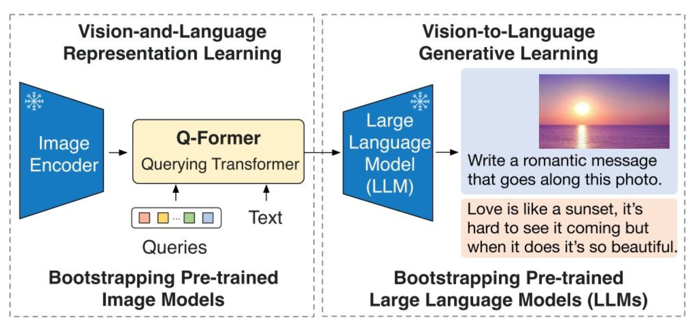
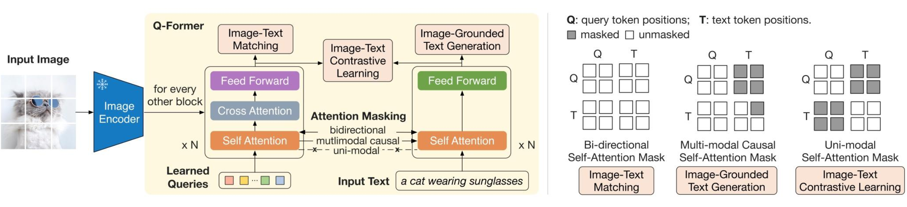

##  1. BLIP2的原理

BLIP-2 是一种**高效且通用的视觉-语言预训练策略**，它的关键在于：

- 采用**冻结的**（Frozen）**预训练图像编码器**（如 CLIP）。

- 采用**冻结的**（Frozen）**大语言模型**。

- 通过一个**轻量级的查询 Transformer（Q-Former）** 作为桥梁，将视觉特征转换为文本可理解的表示。

BLIP训练分为两个阶段：

### 第一阶段：视觉与语言的“感知对齐” (Vision-Language Representation Learning)

- **目的**：训练 **Q-Former**，让它学会从图像编码器（Image Encoder）输出的茫茫特征中，精准提取出与文本描述最相关的语义。
    
- **计算逻辑**：模型会同时输入图片和对应的文本，Q-Former 会通过三个任务来打磨自己：
    
    1. **图文对比学习 (ITC)**：让匹配的图文特征靠拢，不匹配的推开。使用Uni-model Self-Attention Mask（单模态自注意力掩码），图像和文本共用一个Self-Attention，如果不使用Uni-model Self-Attention Mask，这样提取出来的文本特征就变成了“包含图像信息的混合特征”。在做对比学习时，模型会发现识别图文对变得极其简单，因为它直接从特征里就能读出对方的信息。
        
    2. **图文匹配 (ITM)**：判断这张图和这段话是不是一对。使用**Bi-directional Self-attention Mask（双向自注意力掩码）** 实际上不进行任何因果限制。ITM是一个二分类任务，判断图像与文本是否匹配，因此需要能够对图像和文本的每一个token进行全局跨模态交互。
        
    3. **图像描述生成 (ITG)**：尝试根据图像特征“写”出描述。ITG 的目标是训练 Q-Former 具备**生成文本能力**。它要求模型在给定图像特征的前提下，能够自回归地（逐词地）生成对应的文本描述（Caption）。由于涉及到自回归任务，文本只能看到过去的词，所以需要使用多模态因果掩码 (Multimodal Causal Mask)。

### 第二阶段：视觉到语言的“生成适配” (Vision-to-Language Generative Learning)

在这一阶段，**LLM 加入训练，但依然处于冻结状态**。

- **目的**：让 Q-Former 提取出来的视觉特征（Learned Queries）能够被 LLM “听懂”并作为提示词（Prompt）来生成文本。
    
- **操作逻辑**：
    
    1. 将第一阶段训练好的 Q-Former 的输出，通过一个线性投影层（Linear Layer）连接到 LLM 的输入端。
        
    2. **训练目标**：给定一张图片，强迫模型输出正确的文本描述。
        
    3. 在这个过程中，梯度只在 Q-Former 上更新。
        
- **结果**：Q-Former 学会了如何把视觉信息转化为 LLM 能够理解的“软提示（Soft Prompts）”。

## 2. LLava的原理

LLava由以下部分组成：

- **Vision Tower (视觉编码器)**：通常采用 **CLIP ViT-L/14**。它负责把图像切成一个个小块（Patches），并提取高维特征。
    
- **LLM (大语言模型)**：LLaMA等。
    
- **Projection Matrix (投影层)**：这是 LLaVA 的精髓。它使用一个简单的 **MLP（多层感知机）**，将视觉特征向量“翻译”成 LLM 能理解的 Token 嵌入（Embedding）。

**视觉指令微调（Visual Instruction Tuning, VIT）** 是构建多模态大模型（VLM）的核心环节。其核心逻辑在于通过大规模“图像-指令-回复”三元组数据，将视觉特征与人类意图对齐，使模型从被动的特征提取演进为主动的任务执行。其价值体现在：

- **从“内容解析”到“意图对齐”**：模型不再局限于基础的视觉识别，而是能精准捕捉人类指令的深层语义，实现复杂的图像描述、因果推理与逻辑问答。
    
- **强化通用泛化性能**：通过指令的多样性触发模型的零样本（Zero-shot）学习潜力，使其能够灵活应对未见过的交互场景。
    
- **抑制生成幻觉**：依托高质量、确定性的指令监督，强化模型回答的“忠实度”，确保输出高度契合视觉事实。